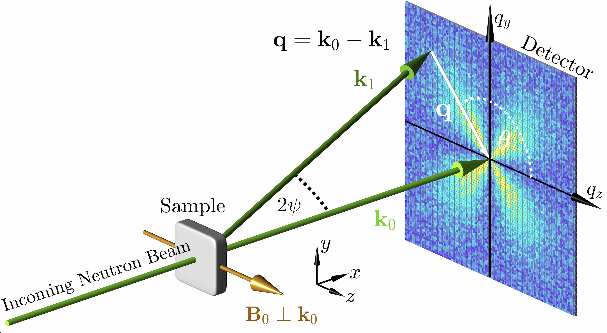

# NuMagSANS
GPU accelerated simulation software for **Nu**clear and **Mag**netic **S**mall-**A**ngle **N**eutron **S**cattering



## 🧑‍🔬 Authors
**Michael P. Adams<sup>1</sup>**, **Andreas Michels<sup>1</sup>**

<sup>1</sup> Department of Physics and Materials Science, University of Luxembourg, 162A Avenue de la Faiencerie, L-1511 Luxembourg, Grand Duchy of Luxembourg


## 📦 Project Status

| **Description** | **Badge** |
|:-----------------|:----------|
| ⚙️ **CUDA Build** | [](https://github.com/AdamsMP92/NuMagSANS/actions/workflows/cuda-build.yml) |
| ⚙️ **Docs Build** | [](https://github.com/AdamsMP92/NuMagSANS/actions/workflows/docs.yml) |
| 📘 **Documentation** | [](https://adamsmp92.github.io/NuMagSANS/) |
| 🧪 **Example 1** | [](https%3A%2F%2Fdoi.org%2F10.5281%2Fzenodo.17491221) |
| 🧪 **Example 2** | [](https%3A%2F%2Fdoi.org%2F10.5281%2Fzenodo.17594693) |
| 🧪 **Example 3** | [](https%3A%2F%2Fdoi.org%2F10.5281%2Fzenodo.17594946) |
| 🖥️ **Platforms** |  |
| 📄 **License** | [](LICENSE) |


## 🧠 About

**NuMagSANS** is a **GPU-accelerated software package** designed for the computation of **nuclear and magnetic small-angle neutron scattering (SANS)** cross sections and correlation functions.  
The program allows users to import discrete datasets representing the **position-dependent nuclear scattering length density** and **magnetization** in real space, providing exceptional flexibility for the analysis of **complex and anisotropic magnetic materials**.

**NuMagSANS** supports simulations across multiple length scales:  
- **Atomistic systems**, featuring complex crystal lattices — e.g., data generated from atomistic spin-dynamics simulations with [*Vampire 7*](https://vampire.york.ac.uk/) or [*UppASD*](https://github.com/UppASD/UppASD.git).  
- **Mesoscopic systems**, such as micromagnetic models — e.g., data generated from micromagnetic simulations with [*MuMax3*](https://mumax.github.io/) or [*OOMMF*](https://math.nist.gov/oommf/).  

The software offers **full rotational control** of the sample orientation, enabling comprehensive studies of **angular-dependent scattering features**.  
It includes a **versatile library of more than +100 response functions**, covering:

- 2D SANS cross sections (unpolarized, SANSPOL, POLARIS)
- 2D correlation functions
- 1D SANS cross sections (azimuthal average)
- 1D correlation functions
- 1D pair-distance distribution functions
- spectral analyser for angular anisotropy

These capabilities provide detailed insights into the **structural and magnetic characteristics** of complex systems.  
Leveraging **GPU acceleration**, *NuMagSANS* achieves **high computational performance and scalability**, making it a **powerful and efficient tool for advanced SANS simulations and data analysis**.

## 📂 Example Datasets

The benchmark datasets associated with **NuMagSANS** are openly available on [Zenodo](https://zenodo.org) and serve as reference examples for validation and reproducibility.  
Each dataset contains both the **real-space magnetic configuration** (nuclear and magnetic scattering-length density distributions) and the corresponding **SANS observables** computed with *NuMagSANS*, including simulated 2D scattering cross-sections and azimuthally averaged intensity profiles.  

Together, these datasets provide a consistent set of input and output examples that demonstrate the end-to-end workflow of *NuMagSANS* — from magnetic structure generation to Fourier-space analysis of small-angle neutron scattering.

- [**NuMagSANS – Example 1:** Spherical nanoparticle with uniform magnetization (v1.0)](https://doi.org/10.5281/zenodo.17491221)  
- [**NuMagSANS – Example 2:** Spherical nanoparticle with linearized vortex magnetization (v1.0)](https://doi.org/10.5281/zenodo.17594693)  
- [**NuMagSANS – Example 3:** MuMax3-based simulation pipeline for an ensemble of iron nanoparticles with vortex spin textures (v1.0)](https://doi.org/10.5281/zenodo.17594946)

## 🤝 How to Contribute

Contributions, bug reports, and feature suggestions are always welcome!  
If you’d like to contribute code or improve the documentation, please follow these steps:

1. **Fork** the repository to your own GitHub account.  
2. **Create a new branch** for your feature or fix:  
   ```bash
   git checkout -b feature/your-feature-name

## 📚 How to Cite
To Do nn

## ⚙️ Building from Source

To Do

## 🧾 License
MIT License

## 🎓 Acknowledgements

This project was developed at the [University of Luxembourg](https://www.uni.lu),  
Department of Physics and Materials Science, [Nanomagnetism Group](https://nanomaglux.com) (Prof. Andreas Michels).

This work was carried out within the scientific framework of the  
[Luxembourg National Research Fund](https://www.fnr.lu) (FNR) projects AFR 15639149, CORE DeQuSky, and PRIDE MASSENA,  
which have contributed to the broader research environment of this study.

We thank our colleagues for stimulating discussions and valuable scientific exchange: 
I. Titov,
E. P. Sinaga,
V. Kuchkin,
A. Stellhorn,
D. Honecker,
J. Leliaert,
E. Jefremovas,
S. Liscak.
Their insights and perspectives have indirectly contributed to the conceptual
and computational development of this work.

