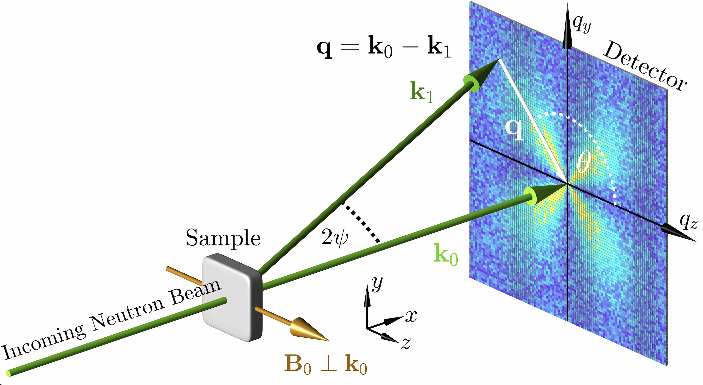

# NuMagSANS
GPU accelerated simulation software for **Nu**clear and **Mag**netic **S**mall-**A**ngle **N**eutron **S**cattering

## 🧑‍🔬 Authors
**Michael P. Adams1**, **Andreas Michels1**

1 Department of Physics and Materials Science, University of Luxembourg, 162A Avenue de la Faiencerie, L-1511 Luxembourg, Grand Duchy of Luxembourg

## 📦 Project Status

| **Description** | **Badge** |
|:-----------------|:----------|
| **Tests** |  |
| **Linting** |  |
| **Code style** |  |
| **Releases** |  |
| **Coverage** |  |
| **Documentation** |  |
| **Platforms** |  |
| **Downloads** |  |
| **License** |  |
| **DOI** |  |

## 🧠 About

**NuMagSANS** is a **GPU-accelerated software package** designed for the computation of **nuclear and magnetic small-angle neutron scattering (SANS)** cross sections and correlation functions.  
The program allows users to import discrete datasets representing the **position-dependent nuclear scattering length density** and **magnetization** in real space, providing exceptional flexibility for the analysis of **complex and anisotropic magnetic materials**.

**NuMagSANS** supports simulations across multiple length scales:  
- **Atomistic systems**, featuring complex crystal lattices — e.g., data generated from atomistic spin-dynamics simulations with [*Vampire 7*](https://vampire.york.ac.uk/) or [*UppASD*](https://github.com/UppASD/UppASD.git).  
- **Mesoscopic systems**, such as micromagnetic models — e.g., data generated from micromagnetic simulations with [*MuMax3*](https://mumax.github.io/) or [*OOMMF*](https://math.nist.gov/oommf/).  

The software offers **full rotational control** of the sample orientation, enabling comprehensive studies of **angular-dependent scattering features**.  
It includes a **versatile library of more than 70 response functions**, covering:

- 2D SANS cross sections (unpolarized, SANSPOL, POLARIS)
- 1D SANS cross sections (azimuthal average)
- 1D correlation functions
- 1D pair-distance distribution functions
- 2D correlation functions

These capabilities provide detailed insights into the **structural and magnetic characteristics** of complex systems.  
Leveraging **GPU acceleration**, *NuMagSANS* achieves **high computational performance and scalability**, making it a **powerful and efficient tool for advanced SANS simulations and data analysis**.

## How to Cite
To Do

## 🧾 License
MIT License

## 🎓 Acknowledgements

This project was developed at the [University of Luxembourg](https://www.uni.lu),  
Department of Physics and Materials Science, [Nanomagnetism Group](https://nanomaglux.com) (Prof. Andreas Michels).

This work was carried out within the scientific framework of the  
National Research Fund (FNR) projects AFR 15639149, CORE DeQuSky, and PRIDE MASSENA,  
which have contributed to the broader research environment of this study.

We thank our colleagues for stimulating discussions and valuable scientific exchange: 
I. Titov,
E. P. Sinaga,
V. Kuchkin,
A. Stellhorn,
D. Honecker,
J. Leliaert,
E. Jefremovas,
S. Liscak.
Their insights and perspectives have indirectly contributed to the conceptual
and computational development of this work.

